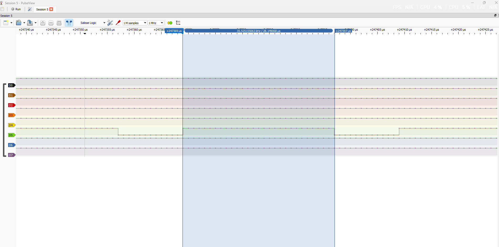
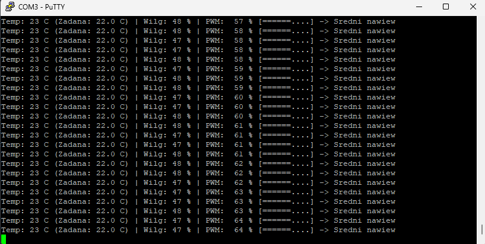

# STM32 Smart Fan Controller (DHT11 + 25 kHz PWM + PID)

Inteligentny sterownik wentylatora chłodzącego z zamkniętą pętlą sprzężenia zwrotnego (closed-loop), zrealizowany na mikrokontrolerze **STM32F407** (ARM Cortex-M4).

Układ odczytuje temperaturę otoczenia za pomocą czujnika **DHT11**, przetwarza uchyb regulacji w dyskretnym algorytmie **PID z zabezpieczeniem anti-windup**, a następnie precyzyjnie moduluje prędkość obrotową 4-przewodowego wentylatora bezszczotkowego (BLDC) za pomocą sprzętowego sygnału **PWM 25 kHz** zgodnego ze specyfikacją Intel 4-Wire. Całość przesyła telemetrię diagnostyczną w czasie rzeczywistym przez interfejs **UART**.

---

## 🛠 Hardware & Narzędzia

- **MCU:** STM32F407VGT6 (rdzeń ARM Cortex-M4 @ 168 MHz)
- **Czujnik:** DHT11 (temperatura i wilgotność)
- **Element wykonawczy:** 4-pinowy komputerowy wentylator BLDC 12V (zgodny ze standardem Intel PWM)
- **Pomiary & Diagnostyka:** 8-kanałowy analizator stanów logicznych (PulseView / sigrok), PuTTY
- **Środowisko programistyczne:** CLion (CMake), STM32CubeMX, GNU Arm Embedded Toolchain (`arm-none-eabi-gcc`)

---

## 🔌 Połączenie sprzętowe (Wiring)

### 1. Czujnik DHT11
| Wyprowadzenie DHT11 | STM32 / Zasilanie | Funkcja | Uwagi |
| :--- | :--- | :--- | :--- |
| **VCC (+)** | **5V** | Zasilanie | Stabilna praca czujnika (zakres 3.5V – 5.5V) |
| **GND (-)** | **GND** | Masa | Wspólna masa układu |
| **DATA / OUT** | **PA1** | Linia danych 1-Wire | Podciągnięta zewnętrznym rezystorem pull-up (4.7 kΩ – 10 kΩ) do 5V |

### 2. Wentylator 4-Pin PWM
| Przewód wentylatora | Połączenie | Funkcja | Uwagi |
| :--- | :--- | :--- | :--- |
| **Pin 1 (GND)** | **GND zasilacza 12V & GND STM32** | Masa | **Kluczowa wspólna masa** mikrokontrolera i zasilacza |
| **Pin 2 (VCC)** | **+12V (Zasilacz zewnętrzny)** | Zasilanie silnika | Podłączone bezpośrednio do zasilacza (poza płytką MCU) |
| **Pin 3 (TACH)** | *Niepodłączony (opcjonalny)* | Czujnik Halla (RPM) | Wyjście typu otwarty kolektor (2 impulsy / obrót) |
| **Pin 4 (PWM)** | **PA5 (TIM2_CH1)** | Sygnał sterujący | PWM 25 kHz, Alternate Function Push-Pull |

---

## ⚙️ Architektura oprogramowania i algorytm

### 1. Generacja sprzętowego PWM 25 kHz
Zgodnie ze specyfikacją *Intel 4-Wire PWM Fan*:
- Sygnał sterujący musi pracować z częstotliwością **$25\text{ kHz}$** ($T = 40\ \mu\text{s}$), aby zapobiec zjawisku magnetostrykcji i piskom cewek w paśmie słyszalnym.
- Wykorzystano timer **TIM2** na szynie **APB1** ($f_{\text{timer}} = 84\text{ MHz}$).
- Zastosowano konfigurację:
  $$\text{PSC} = 0, \quad \text{ARR} = 3359 \implies f_{\text{PWM}} = \frac{84\,000\,000}{(0 + 1) \cdot (3359 + 1)} = 25\,000\text{ Hz}$$
- Zapewnia to rozdzielczość sterowania na poziomie **3360 dyskretnych kroków** wypełnienia.

### 2. Dyskretny regulator PID chłodzenia
- **Uchyb:** $e = T_{\text{aktualna}} - T_{\text{zadana}}$ (uchyb dodatni wymusza mocniejsze chłodzenie).
- **Anti-Windup:** Ograniczenie wartości całki (clamping) zapobiega nasyceniu członu całkującego przy dużej bezwładności termicznej obiektu.
- **Derivative on Measurement:** Człon różniczkujący liczony po zmianie mierzonej temperatury ($dT/dt$), co eliminuje tzw. *derivative kick* przy zmianie temperatury zadanej.
- **Dolny próg (Idle):** Ograniczenie sygnału wyjściowego w zakresie $[20\%, 100\%]$ zapewnia stabilną pracę hydrodynamiczną wentylatora bez zjawiska gaśnięcia komutacji.

---

## 📊 Weryfikacja pomiarowa (Testing & Diagnostics)

### 1. Przebieg PWM na analizatorze logicznym (PulseView)
Generowany sygnał zweryfikowano analizatorem logicznym przy próbkowaniu 12–24 MSa/s.
Dla stanu pracy „Lekki nawiew” (wypełnienie 40% przy zadanej częstotliwości 25 kHz):
- Pełen okres sygnału: $T = 40\ \mu\text{s}$
- Czas trwania stanu wysokiego: $t_{\text{high}} = 16\ \mu\text{s}$ ($\frac{16}{40} = 40\%$)

### 2. Telemetria UART (PuTTY)
System w pętli co 2 sekundy raportuje aktualny stan regulacji wraz z 10-stopniowym paskiem ASCII i opisem intensywności:

### 2. Telemetria UART (PuTTY)
System w pętli co 2 sekundy raportuje aktualny stan regulacji wraz z 10-stopniowym paskiem ASCII i opisem intensywności nawiewu:

